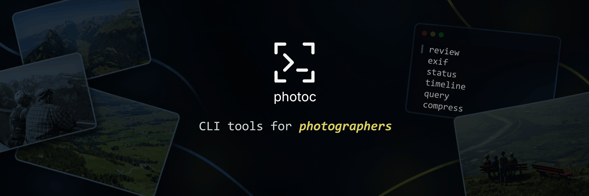

[](https://github.com/ahmetomerv/photoc/releases/latest)
[](https://github.com/ahmetomerv/photoc/actions/workflows/ci.yml)
[](https://github.com/ahmetomerv/photoc/actions/workflows/release.yml)
[](LICENSE)


# photoc

**Command-line tools for photographers.**

`photoc` helps you review, organize, and prepare photos from the terminal.
Summarize a shoot, read metadata, find blurry shots and exact duplicates,
rename and sort photos into folders, make contact sheets and smaller copies,
or remove GPS location before sharing. Every command works in shell scripts,
and most can print JSON.

photoc works with **JPEG** files and reads metadata from **Sony ARW** RAW
files. Other RAW formats (CR3, NEF, RAF, DNG, …) and HEIC are not supported
yet. See [File-type support](#file-type-support).

## Table of contents

- [Quick start](#quick-start) · [Commands](#commands) · [Workflows](#workflows)
- [File safety](#file-safety) · [Scripting](#scripting) · [Installation](#installation)
- [Troubleshooting](#troubleshooting) · [Contributing](#contributing) · [License](#license)


> photoc never changes your original files unless you ask it to with `--apply`
> (`rename`, `sort`) or `--in-place` (`scrub`). It never overwrites existing
> files.

Read-only commands only read. Commands that create files write new copies next
to your originals or in a folder you choose. See [File safety](#file-safety)
for details.

photoc is **not** a RAW developer, an image editor, a photo catalog, or a
replacement for deep metadata editors such as
[ExifTool](https://exiftool.org/). Windows is not supported yet.

## Quick start

Install photoc from its Homebrew tap (macOS or Linux with Homebrew):

```sh
brew install ahmetomerv/photoc/photoc
photoc --version
```

The qualified name adds the tap automatically; Homebrew installs the required
libraries. For a prebuilt executable instead, use the
[shell installer](#shell-installer).

Then try these read-only commands on your own photos:

```sh
photoc --help                         # list commands
photoc exif photo.jpg                 # one photo's metadata
photoc stats ./photos --recursive     # summarize a folder and its subfolders
photoc timeline ./photos              # review a shoot by session
```

For example, `photoc rename ./shoot --format '{date}_{camera}_{sequence}.{ext}'`
previews these three sample JPEGs without changing any files:

```text
session_1000.jpg -> 2026-09-27_Model S_0001.jpg
session_1030.jpg -> 2026-09-27_Model S_0002.jpg
session_1200.jpg -> 2026-09-27_Model S_0003.jpg
Summary: 3 JPEG, 3 planned, 0 unchanged, 0 blocked, 0 applied, 0 rolled back
```

For help with a specific command, run `photoc <command> --help` or `man photoc`.

Directory scans look only inside the chosen folder unless you add
`--recursive`, and they do not follow symlinks. Quote paths containing
spaces, such as `photoc exif "Summer trip/photo.jpg"`. Put options before
`--` when a path begins with `-`, for example `photoc exif -- -photo.jpg`.

## Commands

Each command name links to its guide with options, examples, limits, and a
JSON schema where supported. All guides are listed in the
[documentation index](docs/README.md).

**Inspect** (read-only):

| Command | Purpose |
| --- | --- |
| [`exif`](docs/exif.md) | Show dimensions, camera, exposure, capture time, and GPS for one photo |
| [`stats`](docs/stats.md) | Summarize storage, capture dates, cameras, lenses, and exposure settings |
| [`timeline`](docs/timeline.md) | Group a shoot by date and session |
| [`query`](docs/query.md) | Find photos matching metadata filters such as ISO, aperture, camera, or date |
| [`duplicates`](docs/duplicates.md) | Find byte-identical files and show potential space savings |
| [`focus`](docs/focus.md) | Rank JPEGs by sharpness score, lowest first, to help culling |
| [`check`](docs/check.md) | Audit JPEGs for structural and decoding problems |

**Organize** (preview by default; add `--apply` to change files):

| Command | Purpose |
| --- | --- |
| [`rename`](docs/rename.md) | Rename photos using metadata templates such as `{date}_{camera}_{sequence}.{ext}` |
| [`sort`](docs/sort.md) | Move photos into `YYYY/MM/DD/` or `session-001/` folders |

**Make copies** (originals unchanged by default):

| Command | Purpose |
| --- | --- |
| [`compress`](docs/compress.md) | Write smaller JPEG copies at a chosen quality or target file size |
| [`contact`](docs/contact.md) | Make paged JPEG contact sheets with filenames and optional exposure data |
| [`scrub`](docs/scrub.md) | Write copies without GPS, private fields, or descriptive metadata |

`--json` works with `exif`, `stats`, `timeline`, `query`, `duplicates`,
`focus`, and `check`. Longer directory operations show progress on stderr; use
`--no-progress` to turn it off.

### File-type support

| Command | JPEG | Sony ARW | Other RAW files |
| --- | --- | --- | --- |
| `exif`, `stats`, `timeline`, `rename`, `sort` | Metadata | Common TIFF/EXIF metadata | Unsupported/skipped |
| `query`, `check`, `compress`, `contact`, `focus`, `scrub` | Supported | Unsupported/skipped | Unsupported/skipped |
| `duplicates` | Exact bytes | Exact bytes | Exact bytes |

ARW support is **metadata only**: no RAW development, pixel decoding,
compression, or GPS rewriting. Files are matched by extension (`.jpg`,
`.jpeg`, `.arw`, case-insensitive). See
[Sony ARW metadata support](docs/raw.md) for fields and limits. Want your
camera supported? See [Contributing](#contributing).

## Workflows

These recipes combine commands the way you might use them after a shoot.
Commands that change files are shown in two steps: preview, then apply.

### After a shoot: review, rename, and sort

```sh
# See how the day breaks into sessions. Adjust --gap to match how you shoot.
photoc timeline ./shoot --gap 45m

# Preview new names, then apply the same command.
photoc rename ./shoot --format '{date}_{camera}_{sequence}.{ext}'
photoc rename ./shoot --format '{date}_{camera}_{sequence}.{ext}' --apply

# Preview session folders, then apply.
photoc sort ./shoot --by session --gap 45m
photoc sort ./shoot --by session --gap 45m --apply
```

If any photo lacks the metadata a plan needs, such as a capture date, the
whole plan is blocked and nothing changes. The preview lists the blocked files.

### Culling: find blurry shots and duplicates

```sh
# Lowest sharpness scores first; show only those below the threshold.
photoc focus ./shoot --recursive --threshold 100 --only-blurry

# Byte-identical copies, for example from importing a card twice.
photoc duplicates ./shoot --recursive
```

Sharpness scores are a review aid, not a verdict: subject detail, noise, and
intentional blur all affect them. photoc never deletes files; you decide what
to remove.

### Before sharing: smaller copies without location

```sh
# Write compressed copies into ./share, keeping the originals.
photoc compress ./selects --recursive --target 2MB --output-dir ./share

# Remove location and identifying metadata from those copies.
photoc scrub ./share --privacy --recursive --in-place

# Confirm no copy still has GPS (prints nothing when clean).
photoc query ./share --recursive --has-gps
```

`compress` keeps EXIF, including GPS, by default, so scrub after compressing.
`--in-place` is used here only because `./share` contains copies; it replaces
files without a backup. `--privacy` can leave data in opaque MakerNotes; see
the [scrub limits](docs/scrub.md).

### Find specific shots

```sh
photoc query ./photos --recursive --iso ">800" --aperture "<=4"
photoc query ./photos --camera "DSC-RX100M7A"
photoc query ./photos --after 2026-01-01 --before 2026-12-31
```

Filters are combined with AND, and date bounds include the named days. See
[query details](docs/query.md) for matching rules and NUL-separated output.

### More examples

```sh
# Contact sheet with exposure data, sorted by capture time.
photoc contact ./shoot --output sheet.jpg --metadata --sort date

# Check a folder for corrupt or truncated JPEGs.
photoc check ./photos --recursive --only-errors

# Save statistics as JSON for your own scripts.
photoc stats ./photos --recursive --json > stats.json
```

## File safety

| Command | Changes originals? | Output | Existing files |
| --- | --- | --- | --- |
| Inspect commands | Never | Report on stdout | Not touched |
| `rename`, `sort` | Only with `--apply` | Renames or moves in place | Never overwritten; whole plan checked first |
| `compress` | Never | `photo.compressed.jpg` copies | Skipped (directory) or rejected (single file) |
| `contact` | Never | `sheet.jpg`, `sheet-001.jpg`, … | Never overwritten |
| `scrub` | Only with `--in-place` | `photo.scrubbed.jpg` copies | Rejected |

Important details:

- **Rename and sort** check the whole plan before changing anything. If a
  rename or move fails, photoc tries to undo earlier changes, but another
  process changing files at the same time can prevent full recovery. Keep
  backups of important collections.
- **Compress** loses image detail and can produce a larger file. EXIF
  (including orientation and GPS), ICC color profiles, and XMP are preserved;
  other APP markers are not copied. If a `--target` size cannot be reached,
  photoc still writes a copy at the minimum quality and exits with status
  **1**. `2MB` means 2,000,000 bytes; `2MiB` means 2,097,152 bytes. See
  [metadata preservation](docs/compress.md#metadata-preservation).
- **Scrub** copies JPEG image data without recompression. `--gps` removes EXIF
  GPS only; `--privacy` removes supported location and identifier fields;
  `--all-metadata` removes descriptive metadata but keeps ICC profiles and
  orientation. Information in opaque MakerNotes or unknown formats may remain.
- **`scrub --in-place` creates no backup.** It verifies a temporary copy, then
  replaces the original in one atomic step. Symlinks, hard links, and files
  that change during processing are refused. Permission bits and group
  ownership are kept; ACLs and extended attributes are not copied.
- **Check** reads without changing anything. An OK result is not a backup or a
  visual-quality guarantee. See [audit limits](docs/check.md#safety-performance-and-limits).

## Scripting

Results go to stdout; status text, warnings, errors, and progress go to stderr.
`--json` output contains only JSON, and missing values are `null`.

```sh
photoc exif photo.jpg --json | jq '.exposure'
photoc timeline ./photos --json | jq '.summary'
photoc query ./photos --recursive --has-gps --print0 | xargs -0 ls -l
```

| Exit code | Meaning |
| --- | --- |
| `0` | Success |
| `1` | A processing or filesystem operation failed, or a compression target was not met |
| `2` | Invalid command usage |

Global options work before or after the command: `-q`/`--quiet` keeps results
but hides status text and non-critical warnings, `-v`/`--verbose` adds
diagnostics on stderr, and `--no-progress` disables the progress display.

The [scripting guide](docs/scripting.md) covers JSON details, per-command exit
code rules, progress, and exactly what quiet and verbose modes show.

## Installation

### Homebrew (recommended)

The [Quick start](#quick-start) uses the project's Homebrew tap. It builds
photoc from source and manages its dependencies. After a new version is
published to the tap, update an existing Homebrew installation with:

```sh
brew update
brew upgrade photoc
photoc --version
```

`brew update` refreshes the tap; `brew upgrade photoc` installs the newer
version. The version badge at the top tracks GitHub releases; Homebrew offers
that version after the update pull request for the
[tap formula](https://github.com/ahmetomerv/homebrew-photoc/blob/main/Formula/photoc.rb)
is merged. See the [installation guide](docs/installation.md#homebrew-recommended)
for details.

### Shell installer

The shell installer downloads a checksum-verified prebuilt release for
**macOS arm64**, **macOS x86_64**, or **Linux x86_64** to `$HOME/.local/bin`.
Install the runtime libraries for your system first:

```sh
# macOS
brew install libexif jpeg-turbo libxml2
```

```sh
# Ubuntu / Debian
sudo apt install libexif12 libturbojpeg libjpeg8 libxml2
```

Then download and run the installer:

```sh
curl -fsSL https://raw.githubusercontent.com/ahmetomerv/photoc/main/scripts/install.sh \
  -o install-photoc.sh
sh install-photoc.sh
photoc --version
```

Release binaries require macOS 15 or later, or glibc-based Linux with glibc
2.35 or later. The installer verifies the download's SHA-256 checksum and
never replaces an existing file. If `photoc` is not found, see
[Add photoc to your PATH](docs/installation.md#add-photoc-to-your-path).

- **Choose a version or directory:**
  `sh install-photoc.sh --version vX.Y.Z --install-dir "$HOME/bin"`
- **Upgrade:** preview and remove the tracked shell installation, then run
  the installer again; see [Upgrading](docs/installation.md#upgrading).
- **Uninstall:** download the uninstaller, preview, then apply:

  ```sh
  curl -fsSL https://raw.githubusercontent.com/ahmetomerv/photoc/main/scripts/uninstall.sh \
    -o uninstall-photoc.sh
  sh uninstall-photoc.sh          # preview
  sh uninstall-photoc.sh --apply  # remove
  ```

  This removes only an unchanged shell-installer installation.

The [installation guide](docs/installation.md) also covers source builds,
shell completions, install locations, the man page, and upgrade behavior.
Source and manual installations have their own
[uninstall instructions](docs/installation.md#uninstalling-a-source-or-manual-installation).

## Troubleshooting

<details>
<summary><code>photoc: command not found</code></summary>

Check that your install directory is on `PATH`. For the shell installer, see
[Add photoc to your PATH](docs/installation.md#add-photoc-to-your-path).

</details>

<details>
<summary>Which photoc installation am I running?</summary>

Run `type -a photoc` to list matching commands and `command -v photoc` to see
which one your shell selects. A Homebrew installation normally resolves to
`$(brew --prefix)/bin/photoc`. If an older shell-installed copy also appears
at `~/.local/bin/photoc`, follow the
[tracked uninstall steps](docs/installation.md#uninstalling-a-tracked-release-installation).
The same path appearing twice in `type -a` usually means its directory occurs
twice in `PATH`.

</details>

<details>
<summary><code>error while loading shared libraries: libturbojpeg.so.0</code> (Linux) or <code>dyld: Library not loaded</code> (macOS)</summary>

A runtime library is missing from a shell or manual installation. Install the
packages listed under [Shell installer](#shell-installer). The prebuilt
executable does not bundle these libraries.

</details>

<details>
<summary>macOS says the binary "cannot be opened" or "cannot be verified"</summary>

Release binaries are not signed or notarized. The installer downloads with
`curl`, which does not trigger this. If you downloaded a binary in a browser,
remove the quarantine flag after verifying its checksum:
`xattr -d com.apple.quarantine ./photoc-darwin-arm64`.

</details>

<details>
<summary>My photos are skipped or reported as unsupported</summary>

photoc reads JPEG files and Sony ARW metadata only, matched by file extension.
See [File-type support](#file-type-support).

</details>

<details>
<summary>Rename or sort says the plan is blocked</summary>

At least one photo is missing metadata the plan needs, such as a capture date
or a field used in your template. The preview names each blocked file. Move
those files elsewhere or choose a template that does not need the missing
field.

</details>

<details>
<summary>A scan succeeded but some files had warnings</summary>

`stats` and `timeline` continue past individual file errors and count them in
the summary. See [exit codes](docs/scripting.md#exit-codes).

</details>

For anything else, [open an issue](https://github.com/ahmetomerv/photoc/issues/new/choose)
with the command you ran, `photoc --version`, your OS, and the full error
output.

## Contributing

Bug reports, documentation fixes, and focused code changes are welcome. You can
also help without writing C: photographers can
[share sample files from other cameras](CONTRIBUTING.md#ways-to-contribute-without-writing-c)
so support for more formats can be tested.

- [CONTRIBUTING.md](CONTRIBUTING.md): building, testing, sanitizers, static
  analysis, and project references for maintainers.
- [Documentation index](docs/README.md): every command guide and reference page.
- [Release notes](docs/release-notes.md): what changed in each version.

Please follow the [code of conduct](CODE_OF_CONDUCT.md). For file corruption,
unsafe overwrites, or suspected vulnerabilities, follow the private reporting
steps in [SECURITY.md](SECURITY.md).

## License

photoc's source is licensed under the [MIT License](LICENSE).
Dependencies retain their own licenses; see [third-party notices](THIRD_PARTY_NOTICES.md).
This software is based in part on the work of the Independent JPEG Group.
